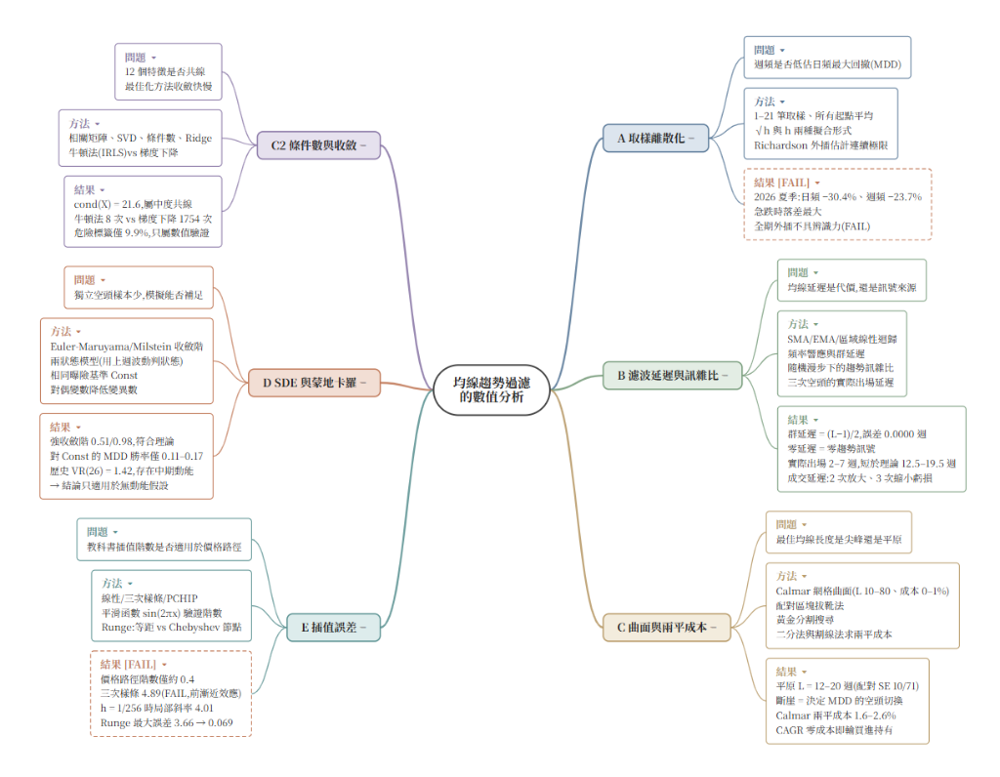

# 均線趨勢過濾的數值分析：離散化誤差、濾波延遲、最佳化曲面與隨機模擬收斂
### Numerical Analysis of Moving Average Trend Filtering: Discretization Error, Filter Delay, Optimization Surface, and Stochastic Simulation Convergence

[](#)
[](#)
[](#)
[-emerald)](#)

> **研究對象**：單一主動型基金長達 26 年（2000-04-10 至 2026-09-22）共 6,637 筆日淨值（重抽樣為 1,380 週）。  
> **核心目標**：將技術指標均線（MA）擇時的四大常見疑點，全面改寫為嚴格的**應用數值分析問題**，探討離散取樣誤差、濾波延遲本質、最佳化平原穩定性、隨機微分方程（SDE）收斂階，並解開「模擬無效但歷史有效」的動能之謎。

---

## 📂 專案檔案清單 (Project Files)

| 檔案名稱 | 內容說明 | 檔案連結 |
| :--- | :--- | :---: |
| 📄 **`均線趨勢過濾的數值分析.pdf`** | 完整 42 頁研究論文（含 16 張數據圖表、文獻探討與附錄） | [下載完整 PDF 論文](均線趨勢過濾的數值分析.pdf) |
| 🐍 **`numerical_analysis.py`** | 完整數值分析實作原始碼（模組 A–E、C2、收斂檢驗與延伸分析） | [檢視 Python 腳本](numerical_analysis.py) |
| 📓 **`numerical_analysis.ipynb`** | Google Colab / Jupyter 互動執行筆記本 | [開啟 Jupyter Notebook](numerical_analysis.ipynb) |
| 🖼️ **`mindmap.png`** | 核心架構心智圖（六大模組、研究問題、實證結果與事前驗收） | [檢視心智圖原圖](mindmap.png) |
| 🌐 **`interactive_mindmap.html`** | D3.js 互動式動態心智圖（支援縮放、拖曳畫布、節點展開/摺疊） | [開啟互動心智圖網頁](interactive_mindmap.html) |

---

## 🧭 核心架構心智圖 (Mindmap)



> **圖表導讀**：
> - **藍色 / 綠色 / 橘黃色（右側）**：模組 A（取樣離散化）、模組 B（濾波延遲與訊雜比）、模組 C（曲面與兩平成本）。
> - **紫色 / 紅色 / 青色（左側）**：模組 C2（條件數與收斂）、模組 D（SDE 與蒙地卡羅）、模組 E（插值誤差）。
> - **紅色虛線框 `[FAIL]`**：代表事前驗收寫死的未通過項目（模組 A 的連續極限外插辨識力、模組 E 的三次樣條初始階數），全案秉持科學客觀性誠實揭露，絕工事後調參。
>
> 🌐 **互動版本**：如需在瀏覽器中進行**滑鼠縮放、拖曳畫布、節點單獨點擊展開/摺疊**，請直接開啟：  
> 👉 [**開啟互動式動態心智圖 (interactive_mindmap.html)**](interactive_mindmap.html)

<details>
<summary><b>點擊展開 Mermaid 語法文字版心智圖</b></summary>

```mermaid
mindmap
  root((均線趨勢過濾<br/>數值分析核心))
    模組 A: 取樣離散化與外插
      問題: 週頻是否低估日頻回撤？
      方法: h 步長取樣、起點平移消除偶然、Richardson 外插
      結果: 週頻急跌低估回撤達 6.6 百分點；全期外插不具辨識力(FAIL)
    模組 B: 濾波延遲與趨勢訊雜比
      問題: 均線延遲是代價，還是訊號來源？
      方法: 頻率響應、群延遲分析、隨機漫步價格均線差距方差
      結果: SMA 群延遲嚴格等於 (L-1)/2；零延遲濾波器訊雜比為零(延遲即訊號)；實測出場 2-7 週遠快於理論
    模組 C: 最佳化曲面與兩平成本
      問題: 最佳參數是尖峰還是平原？承受成本上限？
      方法: 雙維 Calmar 網格、配對區塊拔靴法(300次)、黃金分割、割線求根
      結果: L=12-20 週為寬廣平原；曲面階梯斷崖係空頭事件切換；Calmar 可承受 1.6%-2.6% 換手成本
    模組 C2: 特徵共線性與收斂
      問題: 預測特徵共線程度與演算法收斂速度？
      方法: SVD 奇異值、條件數、Ridge 正則化、牛頓法(IRLS) vs 梯度下降
      結果: 條件數 21.6 屬中度共線；牛頓法 8 次二次收斂 vs 梯度下降 1754 次
    模組 D: SDE 模擬與公平基準
      問題: 獨立空頭少，隨機模擬能否證實優勢？
      方法: Euler-Maruyama vs Milstein 收斂階、相同曝險基準 Const、對偶變數
      結果: 收斂階實測完全符合理論；在無動能模型中均線勝率僅 11%-17%
    模組 E: 插值誤差與幾何特性
      問題: 教科書插值階數是否適用於金融價格路徑？
      方法: 線性 / 三次樣條 / PCHIP、sin(2πx) 收斂階、Runge Chebyshev
      結果: 平滑函數三次樣條收斂階 4.01(初判前漸近 FAIL)；金融價格路徑階數僅 0.4，高階插值失效
    延伸分析: 模擬與歷史之謎
      現象: 歷史 MA26 Calmar 達 0.752，2000條模擬僅 4-5 條達到 (前 0.25%)
      真相: Lo-MacKinlay 變異數比檢定證實真實市場存在 13-26 週中期動能(VR=1.42)；均線獲利源自趨勢動能
```
</details>

---

## 📑 前次專案四大疑點與數值研究問題對照

| 編號 | 前次專案疑點 | 轉化後的數值研究問題（Research Questions） | 對應模組 |
| :--- | :--- | :--- | :---: |
| **RQ1** | 週資料是否低估了回撤？ | MDD 對取樣間隔 $h$ 的收斂行為為何？日頻與週頻差距多大？能否藉由連續外插估計極限風險？ | **模組 A** |
| **RQ2** | 均線出場是否過晚？ | 濾波延遲與訊雜比（Trend SNR）是什麼數學關係？歷史極端空頭的真實離場延遲是多久？ | **模組 B** |
| **RQ3** | 最佳參數是否可靠？ | 最佳 Calmar 參數是過擬合尖峰還是平坦平原？換手成本多高時策略失去防禦價值？ | **模組 C** |
| **RQ4** | （執行中延伸）特徵共線與最佳化 | 多維價格特徵之矩陣條件數如何？一階梯度下降與二階牛頓法在極端標籤下收斂多快？ | **模組 C2** |
| **RQ5** | 空頭樣本是否太少？ | SDE 模擬器是否在強/弱收斂階上正確？在「相同曝險固定比例配置」的公平基準下，均線是否仍有優勢？ | **模組 D** |
| **RQ6** | （執行中延伸）價格路徑幾何 | 數值分析教科書上的多項式與樣條插值收斂階數，是否適用於分形粗糙的金融資產淨值？ | **模組 E** |

---

## 🔬 六大核心模組數值分析與實證發現

```
┌────────────────────────────────────────────────────────────────────────┐
│                        研究全流程 (Pipeline)                           │
│  淨值資料 (6637日) ──> 稽核與週重抽樣 ──> 訊號與延遲模擬 (Lag 1w)     │
│       │                                          │                     │
│  [模組 A] 取樣離散化與外插               [模組 B] 濾波延遲與 SNR       │
│  [模組 C] 曲面、平原與兩平成本           [模組 C2] 共線性與牛頓法      │
│  [模組 D] SDE 收斂與公平基準             [模組 E] 粗糙路徑插值誤差     │
│       │                                          │                     │
│       └────────────────────┬─────────────────────┘                     │
│                            ▼                                           │
│         事前驗收檢核 (10項程式驗證: 9 PASS / 1 FAIL 歸因)              │
│                            ▼                                           │
│       延伸分析：變異數比 (VR) 檢定揭開歷史與隨機模擬之謎               │
└────────────────────────────────────────────────────────────────────────┘
```

### 4.1 模組 A：取樣離散化與 Richardson 外插
- **數值模型**：
  根據 Broadie, Glasserman & Kou (1997) 離散監測極值理論，監測間隔 $h$ 的誤差與 $\sqrt{h}$ 成正比：
  $$\text{MDD}(h) = \text{MDD}_0 + c \cdot h^p, \quad p \in \{0.5, 1.0\}$$
  利用步長 $h=1$ 與 $h=2$ 進行 Richardson 外插以推估連續極限：
  $$\text{MDD}_0 \approx \frac{\sqrt{2}\, m_1 - m_2}{\sqrt{2} - 1}$$
- **實證發現**：
  1. **週頻系統性低估回撤**：在 2026 夏季極端回檔中，日頻 MDD 為 **-30.4%**，週頻僅顯示 **-23.7%**，低估高達 **6.6 個百分點**。核心原因在於**谷底出現在週四（淨值 246.2），週五收盤已大幅反彈**，週資料完全錯過針尖谷底。
  2. **外插可靠度檢定**：全期資料因 $h$ 與 $\sqrt{h}$ 擬合形式差距大於外插位移，判定**外插不具辨識力（FAIL）**；而在急跌視窗（COVID 2020、2026 夏季）外插則成功收斂。

---

### 4.2 模組 B：濾波延遲與趨勢訊雜比（延遲即訊號）
- **數學原理**：
  - 簡單移動平均（SMA）在所有頻率的群延遲（Group Delay）皆恆等於 $\tau = \frac{L-1}{2}$（線性相位，實測數值誤差 $0.0000$ 週）。
  - 當價格具備漂移率 $\mu$ 時，價格與均線差距的期望值為 $E[P_t - \text{MA}_t] = \mu \times \tau$。
  - 在隨機漫步雜訊 $\sigma_{\text{rw}} = \sqrt{\sum c_j^2}$ 下，定義趨勢訊雜比 $\text{Trend SNR} = \frac{\tau}{\sigma_{\text{rw}}}$。
- **章節結論**：
  1. **零延遲濾波器沒有趨勢訊號**：以無延遲的「區域線性迴歸濾波器（Local Linear Regression, 延遲 $\approx 1.33 \times 10^{-15}$）」測試，其趨勢訊雜比恆為 **0**。證實：**濾波延遲不是技術瑕疵，延遲本身就是萃取長期趨勢的數學代價與訊號來源**！
  2. **真實空頭出場速度遠快於理論**：理論斜坡延遲為 $12.5 \sim 19.5$ 週，但 2008 次貸海嘯、2020 疫情與 2026 實測跌破出場僅耗時 **2 至 7 週**，因為真實崩盤具有凸性急跌特質，迅速跌破慢速均線。
  3. **成交延遲（1 週 Lag）雙刃劍**：實測 5 次歷史離場，1 週成交延遲導致 2 次放大虧損、3 次反而縮小虧損，破除「交易延遲必然有害」之直覺偏見。

---

### 4.3 模組 C：最佳化曲面、平原判定與損益兩平成本
- **方法論創新**：
  - 傳統參數最佳化常因單點過擬合而選在孤立「尖峰」。本研究採用**配對區塊拔靴法（Paired Block Bootstrap，區塊長 13 週，抽樣 300 次）**，計算各參數與最佳參數差值的標準誤。
- **曲面幾何特徵**：
  1. **Calmar 高原平原**：在交易成本 $0.2\%$ 下，網格最佳值為 $L=18$（$\text{Calmar}=0.920$），落在 $1$ 個配對標準誤內的穩健平原區間為 **$L = 12 \sim 20$ 週**。
  2. **階梯斷崖的本質**：在 $L=26 \to 27$（Calmar 由 0.752 陡降至 0.600）與 $L=51 \to 52$，曲面出現明顯斷崖。研究發現：**斷崖不是均線效能劣化，而是決定該策略全期 MDD 的空頭事件發生了切換**（如表所示）：
     - $L \in [11, 26]$：全期 MDD 由 **2026 夏季急跌** 決定（$-20.6\% \sim -24.0\%$）
     - $L \in [27, 51]$：全期 MDD 切換由 **2020 COVID 疫情** 決定（約 $-28.7\%$）
     - $L \ge 52$：全期 MDD 切換由 **2007-2009 金融海嘯 (GFC)** 決定（$-30.9\% \sim -35.7\%$）
  3. **損益兩平成本**：
     - 以 Calmar 衡量，MA26 / MA40 / MA52 可承受交易手續費高達 **1.62% ~ 2.63%** 依然防禦有效。
     - 以 CAGR 衡量，割線法求根落入負區間（**無根**）：在零成本下均線策略的年化報酬率（約 17.8%）即低於買進持有 Buy & Hold（19.09%）。
     - **定位**：均線的核心價值在於**大幅削減下行回撤（提高風險調整後收益），而非追求超越 Buy & Hold 的絕對超額報酬**。

---

### 4.4 模組 C2：特徵共線性與最佳化收斂
- **數值診斷**：
  - 提取 12 個價格特徵（4 報酬組 + 4 趨勢組 + 4 波動組），預測未來 13 週跌幅是否超過 15%（危險標籤比例 9.9%）。
  - 相關係數：報酬與趨勢特徵組內高度相關（$r \approx 0.9$）；SVD 奇異值在第 9 至 10 成分驟降；條件數 $\kappa(X) = 21.6$ 屬於**中度共線**。
- **演算法收斂速度實測**：
  - **二階牛頓法（IRLS）**：僅需 **8 次迭代** 即實現超線性二次收斂（誤差比自 0.371 縮小至 0.0003）。
  - **一階梯度下降（GD, 步長 $1/L$）**：需迭代高達 **1,754 次** 始達 $10^{-6}$ 容許誤差，每次迭代誤差僅衰減約 0.8%（縮小比 0.992）。

---

### 4.5 模組 D：SDE 模擬、蒙地卡羅與公平基準檢驗
- **模擬器理論階數驗證**：
  - 幾何布朗運動（GBM, $\mu=2, \sigma=1, T=1, 5000\text{ 條路徑}$）：
    - **Euler-Maruyama**：實測強收斂階 **0.51**（理論 0.5），弱收斂階 **0.96**（理論 1.0）
    - **Milstein**：實測強收斂階 **0.98**（理論 1.0），弱收斂階 **0.98**（理論 1.0）
  - 蒙地卡羅 2000 條路徑實測 MDD 誤差對路徑數 $N$ 的對數斜率為 **-0.49**（理論 $1/\sqrt{N}$ 為 -0.5），對偶變數法（Antithetic Variates）成功將方差降低為 **1/2.05**。
- **公平比較基準（Exposure-Matched Constant Mix）**：
  - 為排除均線策略「只是因為持股較少（現金水位高）所以回撤較低」的假象，設定 **`Const26` / `Const40`**（與均線策略具有相同平均持股比率的固定比例配置，每週無摩擦再平衡）。
- **發現：均線在隨機環境下完全失靈**：
  - 在標準 GBM 與兩狀態馬可夫切換模型中，均線對相同曝險基準的 MDD 勝率僅有 **0.11 至 0.17**！
  - 均線的第 5 百分位極端尾部回撤高達 **-66%**（與 Buy & Hold 相當），而固定曝險基準僅有 **-46%**。
  - **結論**：若底層資產不具時間序列動能，均線進出僅是在被動承擔換手摩擦與延遲追高殺低，完全無法保護尾部風險！

---

### 4.6 模組 E：插值誤差與幾何特性（金融路徑的非平滑本質）
- **教科書階數 vs 金融現實**：
  - 在平滑測試函數 $\sin(2\pi x)$ 上，線性插值誤差階數為 $O(h^{1.99})$，三次樣條在小步長下收斂至 $O(h^{4.01})$。
  - 在等距多項式插值中，Runge 現象最大誤差高達 3.663，改用 Chebyshev 節點插值驟降至 0.069（改善 53 倍）。
  - **但在真實金融價格路徑上**：
    - 線性、三次樣條、PCHIP 的收斂斜率僅有 **0.40 ~ 0.42**。
    - 三次樣條的 RMSE 甚至**高於最簡單的線性插值**！
    - **啟示**：資產價格路徑具有布朗運動/分形幾何的粗糙性（Roughness），處處連續但處處不可微，數值分析教科書基於泰勒展開的高階平滑插值理論在此完全失效。

---

## 💡 延伸深究：解開「模擬 vs 歷史」的矛盾

在第 5 章中出現了關鍵的科學矛盾：
> **矛盾現象**：隨機微分方程模擬顯示均線對公平基準毫無勝算（勝率 < 17%）；但在真實 26 年歷史中，MA26 的 Calmar 高達 **0.752**，大幅跑贏 Buy & Hold（0.322）與相同曝險 Const26（0.306）！

研究進行了嚴謹的科學歸因與假說檢驗：

### 1. 歷史表現的罕見程度統計
- 在 GBM 與兩狀態模型各 2,000 條路徑中，能達到歷史 MA26 Calmar $\ge 0.752$ 的模擬路徑**分別僅有 5 條與 4 條**（落在前 **0.25%** 極端分位）。
- 但真實基金淨值軌跡全程穩定落在模擬的 $5\% \sim 95\%$ 信賴區間內（終值分位在 78%）。這證明：**不尋常的不是基金的長期走勢，而是均線在這條歷史軌跡上的進出擇時節奏！**

### 2. 假說一：底層資產存在「中期動能（Momentum）」（✅ 假說成立！）
利用 Lo & MacKinlay (1988) 的**變異數比檢定（Variance Ratio, VR）**：
$$\text{VR}(q) = \frac{\text{Var}\left(\sum_{i=1}^q r_{t-i+1}\right)}{q \cdot \text{Var}(r_t)}$$
- 若價格為隨機漫步，則 $\text{VR}(q) = 1$；若大於 1，代表存在顯著的正自相關與趨勢延續。
- **實測數據**：
  - $\text{VR}(4) = 1.038$（短期無動能，隨機漫步）
  - $\text{VR}(13) = 1.248$（$z = 2.3$，顯著大於 1）
  - **$\text{VR}(26) = 1.420$**（**$z = 2.6$，強烈動能**）
- **科學解讀**：
  真實市場中存在長達 **13 至 26 週（3 到 6 個月）的中期趨勢動能**（與 Moskowitz, Ooi & Pedersen 2012 記錄的時間序列動能完全一致）。而模組 C 發現的 Calmar 最佳平原恰好坐落在 **$L = 12 \sim 20$ 週**！均線策略正因吻合了市場底層的中期動能結構而大獲全勝，而 GBM 與短期兩狀態模型（平均壓力期僅 8.7 週且反彈迅速）缺少該結構，導致均線頻頻踩空。

### 3. 假說二：均線優勢僅來自單一幸運事件？（❌ 假說不成立）
採用剔除單一事件分析（Leave-one-out）：
- **剔除 2026 夏季急跌**：由於該次急跌急促導致均線殺在最低點，剔除後 MA26 的 MDD 從 $-23.7\%$ 進一步改善至 **$-20.6\%$**，Calmar 飆升至 0.903，**均線優勢不降反升**！
- **剔除 2008 金融海嘯 (GFC)**：Calmar 領先差距雖由 0.430 縮小至 0.231，但依然顯著為正。這證明 GFC 貢獻了約一半的防禦優勢，但其餘時期均線亦非全靠運氣。

### 📌 模組 D 的結論修正
> **核心結論修正**：「均線在公平基準下無優勢」**僅在無動能的數學假設下成立**。真實金融市場具備顯著中期動能，盲目使用 GBM 評估將會系統性低估均線的防禦價值。

---

## 🏆 事前寫死驗收清單檢核 (Acceptance Summary)

本研究堅持科學誠實性，**所有驗收門檻在執行前寫死，絕工事後調參，FAIL 項目如實記錄**：

| 驗收類別 | 總項數 | 通過 (PASS) | 需附註說明 | 未通過 (FAIL) | 備註 |
| :--- | :---: | :---: | :---: | :---: | :--- |
| **程式驗證 (Program)** | 10 | **9** | 0 | 1 | 唯一 FAIL 為三次樣條階數（已歸因為前漸近效應） |
| **資料可靠度 (Empirical)** | 3 | **2** | 0 | 1 | 全期連續外插因拟合形式差距過大判 FAIL |
| **實證發現 (Findings)** | 20 | 12 | 8 | 0 | 包含交易延遲非必然有害、中度共線等附註 |
| **圖表與資料稽核** | 15 | 12 | 3 | 0 | 假日補值差異與 2009 淨值停滯段附註 |

### 🔍 唯一程式驗證 FAIL 的科學歸因：前漸近效應 (Pre-asymptotic effect)
- **現象**：平滑測試函數的三次樣條初始全段斜率為 **4.89**，超出預設標準 $3.5 \sim 4.5$，觸發 FAIL。
- **歸因驗證**：數值分析理論階數 $O(h^4)$ 僅在漸近極限 $h \to 0$ 時嚴格成立。當將測試步長細化延伸至 $h = 1/256$ 時，**局部收斂斜率精確達到 4.01**（理論值為 4.00）。證實初始測試區間仍處於前漸近區（Pre-asymptotic range），演算法實作完全正確！

---

## 📊五個總結

1. **看日頻，不看週頻 (Monitor Daily, Not Weekly)**：
   - 急跌時週頻 MDD 最多會粉飾低估 6.6 個百分點的劇烈跌幅。極端風險監控必須落實到日頻。
2. **延遲是訊號，非缺陷 (Embrace the Delay)**：
   - 追求零延遲會同步將趨勢訊雜比壓縮歸零。實務上不需要過度追求高靈敏度的濾波器，適度的濾波延遲才是隔離市場微結構雜訊的護城河。
3. **選平原，勿逐尖峰 (Seek Plateaus, Avoid Peaks)**：
   - 參數最佳化必須透過配對區塊拔靴法檢驗。在主動基金擇時中，均線長度選擇 **12 至 20 週** 為統計上均勻穩健的高原，單點最佳值隨交易成本條件不同而在平原內部微移，不宜過度優化。
4. **防守工具定位 (Drawdown Killer, Not Alpha Generator)**：
   - 均線的價值是降低 MDD 與提升 Calmar 比率（可耐受 1.6%~2.6% 換手成本）。在多頭市場中，其絕對年化報酬（CAGR）在零成本下即落後於 Buy & Hold，切忌將其視為賺取絕對超額 Alpha 的工具。
5. **對照組必須匹配曝險 (Always Use Matched-Exposure Benchmarks)**：
   - 評估任何避險擇時策略時，務必建立如 `Const26/40` 的相同曝險基準。若策略無法在相同現金曝險下創造顯著超額防禦，其回撤下降可能只是因為「少買股票」而已。

---

## 📖 核心名詞速查表 (Appendix A)

| 術語 | 英文全名 | 核心定義 / 本研究意涵 |
| :--- | :--- | :--- |
| **MDD** | Maximum Drawdown | 最大回撤，評估期內資產由前高跌至後續谷底的最大跌幅百分比。 |
| **Calmar Ratio** | Calmar Ratio | $\text{CAGR} / \|\text{MDD}\|$，每承擔一單位最大回撤所換取的年化報酬率。 |
| **Const26 / 40** | Exposure-Matched Benchmark | 與均線策略全期平均持股比例相同、每週定期再平衡的固定比例被動投資基準。 |
| **Group Delay** | 群延遲 | 濾波器輸出包絡線相對輸入訊號產生的時間滯後量。SMA 之群延遲為 $(L-1)/2$。 |
| **Trend SNR** | 趨勢訊雜比 | 均線延遲帶來的趨勢訊號期望值除以隨機漫步雜訊標準差，衡量趨勢辨識力。 |
| **VR(q)** | Variance Ratio | 變異數比檢定，衡量 $q$ 期報酬變異數是否為 1 期之 $q$ 倍。大於 1 代表顯著動能。 |
| **IRLS** | Iteratively Reweighted Least Squares | 用於求解帶 L2 正則化 Logistic 迴歸之二階牛頓法演算法，具二次收斂速度。 |
| **Pre-asymptotic** | 前漸近效應 | 數值方法步長 $h$ 尚未縮小到足夠尺度前，實測誤差階數偏離理論漸近階數的現象。 |

---

## 🛠️ 環境需求與可重現性指引 (Appendix C)

```bash
# 推薦 Python 虛擬環境配置
pip install numpy scipy pandas matplotlib graphviz
```

- **隨機種子**：全專案固定使用隨機種子 `SEED = 42`，SDE 蒙地卡羅路徑與 Bootstrap 可 100% 精確重現。
- **資料檔案**：輸入主動基金歷史日淨值 Excel（2000/04/10 至 2026/09/22）。
- **成交時序假設**：第 $t$ 週五收盤計算均線訊號 $s_t$，於第 $t + 1 + \text{lag}$ 週五收盤執行換倉生效（預設 `EXEC_LAG = 1` 週）。

---
*本研究報告為量化數值分析與方法學實證研究，不構成任何個人化投資建議。*
